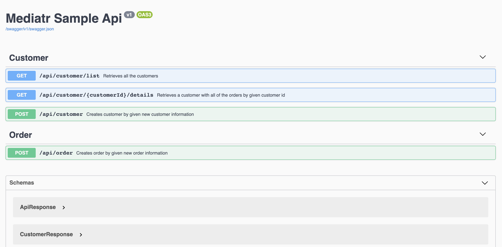

# Sample .NET 8 API Implementation using the Mediator Design Pattern

This project provides a fully functional example of a .NET 8 API built with the Mediator Design Pattern. It demonstrates best practices for handling exceptions, validating requests, and logging through middleware, filters, and behaviors.

## Key Features
- Uses SQLite as a lightweight relational database
- Middleware for centralized exception handling (see [ExceptionMiddlewareExtensions](https://github.com/salihigde/mediatr-sample-api/blob/master/src/Middleware/Extensions/ExceptionMiddlewareExtensions.cs))
- Action Filters for validation and consistent API responses (see [ValidateModelStateAttribute](https://github.com/salihigde/mediatr-sample-api/blob/master/src/Filters/ValidateModelStateAttribute.cs) and [ApiResponseAttribute](https://github.com/salihigde/mediatr-sample-api/blob/master/src/Filters/ApiResponseAttribute.cs))
- Mediator Behaviors for logging actions before and after handler execution (see [LoggingBehavior](https://github.com/salihigde/mediatr-sample-api/blob/master/src/Handlers/Behaviors/LoggingBehavior.cs))

## Swagger Integration


## Getting Started

### Prerequisites
- .NET 8 SDK
- SQLite (no additional setup needed, SQLite is file-based)

### Running the Application
1. **Build the project:**
   
   ```bash
   dotnet build
   ```
2. **Start the application:**
- Option 1: Use debug mode in your IDE.
- Option 2: Run the application from the /src folder:
  
  ```bash
  dotnet run
  ```

3. **Apply Database Migrations (if needed):** To ensure the SQLite database is up-to-date, apply any pending migrations:
   
   ```bash
   dotnet ef database update
    ```
   

### Running Unit Tests
- Run the following command in `MediatrSampleApi.UnitTest` folder:

    ```bash
    dotnet test
    ```

## Built With

### Development
- [FluentValidation](https://github.com/JeremySkinner/FluentValidation) - Library for building strongly-typed validation rules.
- [AutoMapper](https://github.com/AutoMapper/AutoMapper) - A convention-based object-object mapper in .NET
- [Mediatr](https://github.com/jbogard/MediatR) - mediator implementation in .NET
- [Swashbuckle](https://github.com/domaindrivendev/Swashbuckle) - adds a swagger to WebApi projects
- [Entity Framework](https://github.com/aspnet/EntityFrameworkCore)

### Testing
- [FluentAssertions](https://github.com/fluentassertions/fluentassertions) - Fluent API for asserting the results of unit tests that targets
- [MyTested](https://github.com/ivaylokenov/MyTested.AspNetCore.Mvc) - Fluent testing library for ASP.NET Core MVC
- [AutoFixture](https://github.com/AutoFixture/AutoFixture) - Auto-generates test data.
- [Moq](https://github.com/moq/moq4) - Mocking library for .NET.
